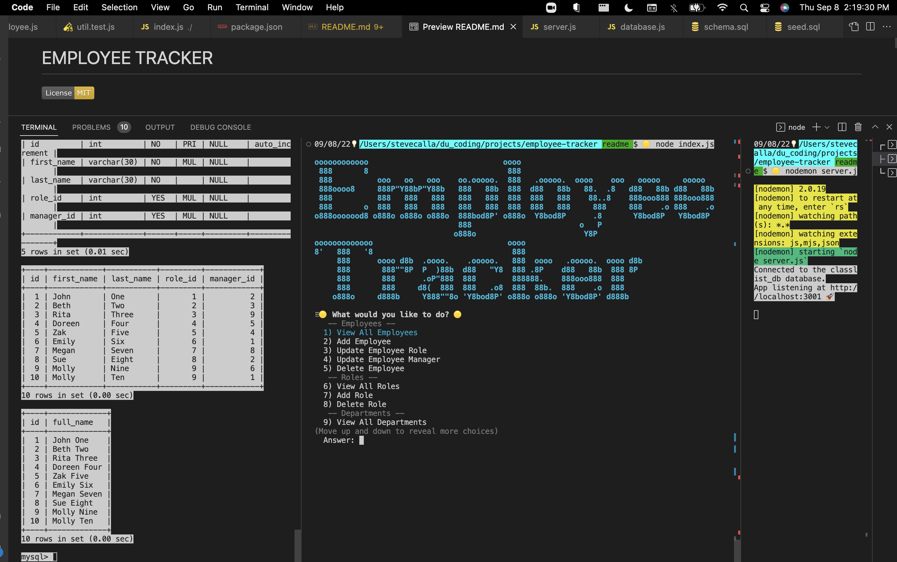

# EMPLOYEE TRACKER 
[](https://opensource.org/licenses/MIT)

## Index

1. [Description](#description)
2. [Installation](#installation)
3. [Usage](#usage)
4. [Features](#features)
5. [Future Enhancements](#future-enhancements)
6. [Contributing](#contributing)
7. [Resources](#resources)
8. [License](#license)

## Description

```
This app is a command-line interface (CLI) that allows a company to view and manage the departments, roles and employees. At the command line the user can generate reports showing all deparments, roles, employees, employees by role, employees by manager, salary by department as well as add, delete departments, roles, employees and update an employees role or manager. 
```

## Installation

(1) Fork the repo, (2) Clone the forked repo locally, (3) Run "npm install" (to install the dependencies), (4) Run "node server.js" to start the server (from the root directory), (6) Run "node.index.js" to start the employee tracker CLI.

## Usage

If you'd like to use NPM nodemon as/if you make changes to the code, please install nodemon as a development dependency using "npm install --save-dev nodemon" (see https://www.npmjs.com/package//nodemon). This CLI allows a user to view and manage the departments, roles and employees of a company.

## Features

This app includes features such as (a) the ability to generate reports showing all deparments, roles, employees, employees by role, employees by manager, salary by department, (b) add, delete departments, roles, employees, and (c) update an employees role or manager.
<!-- 
1. TBD
2. TBD
3. TBD
-->
## Future Enhancements

This app can be enhanced by (a) using/adding dates such as created at, updated at, deleted at to track information by time, (b) add soft and hard delete options so users can recover changes if necessary, (c) add the ability to manage middle names, (d) add more fields for employees or roles such as employee salary, date of birth, social security number (secured in some manner), email address, position start date and more, (e) add ka secure password for the mysql database connection, and (f) add additional testing.
<!-- 
1. TBD
2. TBD
3. TBD
-->

## App Preview - Static Screenshot



## App Preview - Video Preview
[Link to Video](https://www.youtube.com/watch?v=_hr9SKZC5Rc&feature=youtu.be)


## Tests

There are a limited number of tests setup for the helpers util.js file. To run tests install "jest": "^28.1.3" as a dev dependancy, then run "npm test".

For More Information:
1. [NPM Jest](https://www.npmjs.com/package/jest)
2. [Jest Home Page](https://jestjs.io/)

## Contributing

Contributor Covenant Code of Conduct

[](https://www.contributor-covenant.org/version/2/1/code_of_conduct/code_of_conduct.md)

<!-- DELETE THIS SECTION FOR THE FINAL README. For more information on example contribution guidelines please see the links below.

1. Contributor Convent: [Information](https://www.contributor-covenant.org/)
2. Contributor Covenant Code of Conduct: [Markdown File](hhttps://www.contributor-covenant.org/version/2/1/code_of_conduct/code_of_conduct.md)
-->

## Resources

1. Project Manager: [Steve Calla - GitHub Profile](https://github.com/stevecalla)
2. GitHub Repo: <https://github.com/stevecalla/employee-tracker>
3. GitHub Hosted URL: <None. This is command-line interface (CLI) using node.js.>
4. Contact: [Email Steve](mailto:callasteven@gmail.com)

## License 

[](https://opensource.org/licenses/MIT)
This project is licensed under the terms of the <span style="color:red">The MIT License</span>. Please click on the license badge for more information.

<!-- DELETE THIS SECTION FOR THE FINAL README. Per Github, you are under no obligation to choose a license. However, without a license, the default copyright laws apply, meaning that you retain all rights to your source code and no one may reproduce, distribute, or create derivative works from your work. If you're creating an open source project, we strongly encourage you to include an open source license. The Open Source Guide provides additional guidance on choosing the correct license for your project. SEE THE FOLLOWING LINKS FOR MORE INFORMATION:

1. GitHub: [Licensing a repository](https://docs.github.com/en/repositories/managing-your-repositorys-settings-and-features/customizing-your-repository/licensing-a-repository)
2. Open Source Guide: [To Choose A License](https://choosealicense.com/)
-->

<!-- OTHER SECTIONS IF YOU LIKE
## Technologies

1. HTML
2. CSS
3. JavaScript
4. GitHub (website hosting and source code management)
5. TBD
6. TBD

### 3rd Party Application Programming Interfaces

1. [TBD](https://TBD)
2. [TBD](https://TBD)
3. [TBD](https://TBD)

### Dependencies

1. [VS Code Live Server](https://ritwickdey.github.io/vscode-live-server/)

## Collaborators

1. FIRST & LAST NAME: [Github LINK](https://github.com/<Github user name>/)
2. FIRST & LAST NAME: [Github LINK](https://github.com/<Github user name>/)
3. FIRST & LAST NAME: [Github LINK](https://github.com/<Github user name>/)

## Resources

1. GitHub Repo: <https://github.com/tbd/tbd>
2. GitHub Hosted URL: <https://tbd.tbd.com/tbd>
-->
